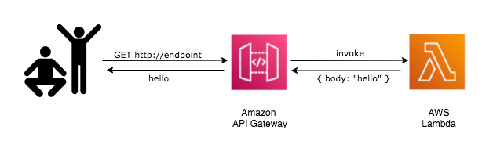

# Welcome to your CDK TypeScript project

You should explore the contents of this project. It demonstrates a CDK app with an instance of a stack (`CdkWorkshopStack`)
which contains an Amazon SQS queue that is subscribed to an Amazon SNS topic.

The `cdk.json` file tells the CDK Toolkit how to execute your app.

## Useful commands

* `npm run build`   compile typescript to js
* `npm run watch`   watch for changes and compile
* `npm run test`    perform the jest unit tests
* `cdk deploy`      deploy this stack to your default AWS account/region
* `cdk diff`        compare deployed stack with current state
* `cdk synth`       emits the synthesized CloudFormation template

# Hello, CDK!
Some CDK code.

Instead of the SNS/SQS code that we have in our default app, we added a AWS Lambda function with an Amazon API Gateway endpoint in front of it.

Users will be able to hit any URL in the endpoint and they'll receive a heartwarming greeting from our function.

